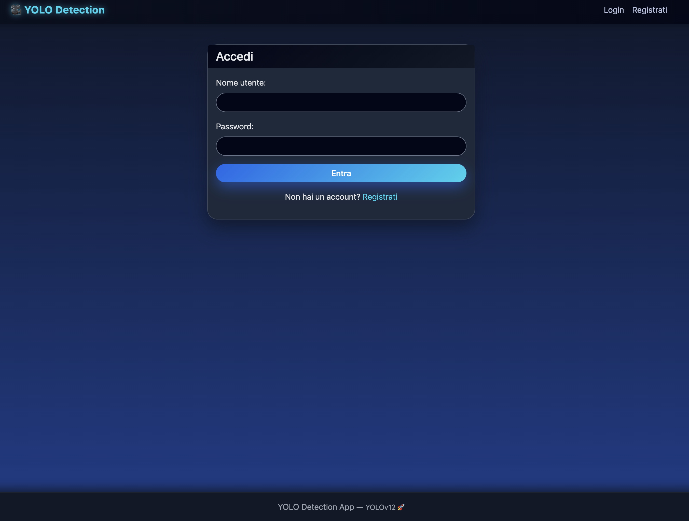
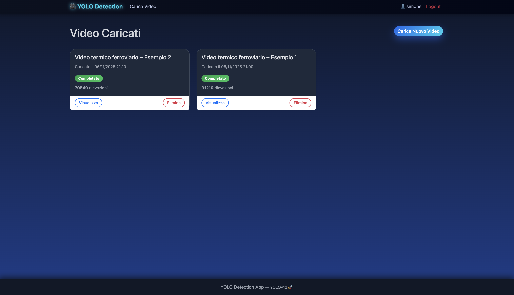
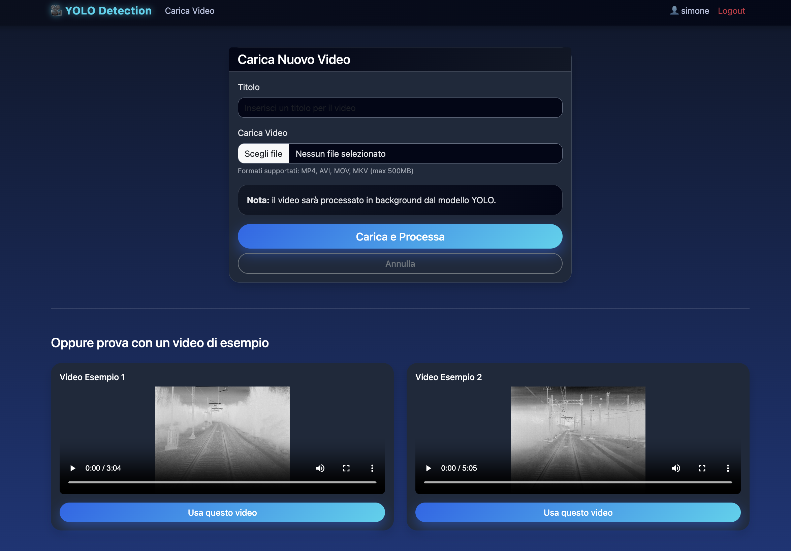
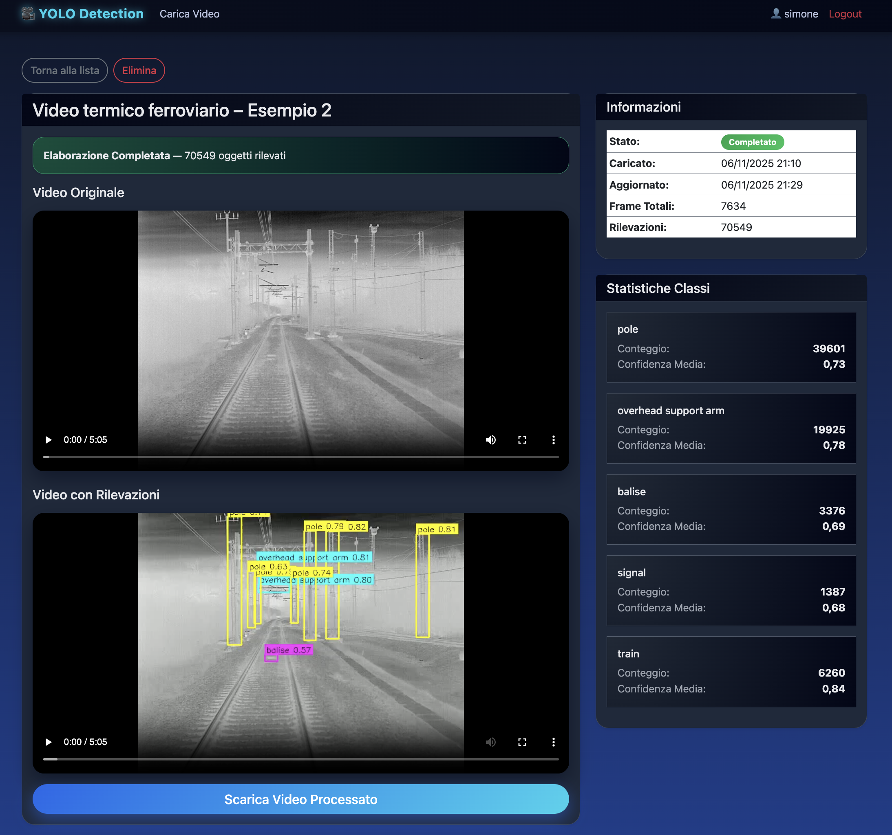

# YOLO Video Detection App

Applicazione Django che esegue analisi video tramite **YOLO**, con elaborazione in background gestita da **Celery** e **Redis**.

---

## 🚀 Avvio rapido con Docker

```bash
git clone https://github.com/Simone2408/sito_yolo.git
cd sito_yolo
```

Avvia tutti i servizi (Django, Celery, Redis):

```bash
docker compose up --build
```

Il sito sarà disponibile su:
👉 **[http://localhost:8000](http://localhost:8000)**

---

## 🧩 Servizi inclusi

* **Django** – Web App & API
* **Celery** – Task queue per elaborare i video in background
* **Redis** – Message broker per Celery

---

## 📸 Anteprima dell'app

### 🔐 Pagina di Login



### 🏠 Home / Lista Video



### ⬆️ Carica Video



### 🎥 Dettaglio Video Analizzato



---

## 🛠️ Comandi utili

### Arrestare tutti i container

```bash
docker compose down
```

### Avvio locale (senza Docker)

```bash
redis-server
celery -A yolo_detection worker --loglevel=INFO
python manage.py runserver
```

---

## 📁 Note importanti

### 🔽 Download modello YOLO

Puoi scaricare i pesi pre-addestrati da Google Drive:
👉 [Scarica yolov12_finetuned.pt](https://drive.google.com/file/d/1V6x8ROG5AGGCQ5PUdtZkr4UnbfXqBrZb/view?usp=drive_link)

* I video caricati vengono salvati in **media/**
* Il modello YOLO deve essere posizionato in:

  ```
  models/yolov12_finetuned.pt
  ```
* Funziona completamente anche senza GPU (usa CPU fallback)

---

✨ Progetto sviluppato per analisi video automatizzate con YOLO + Django + Celery
